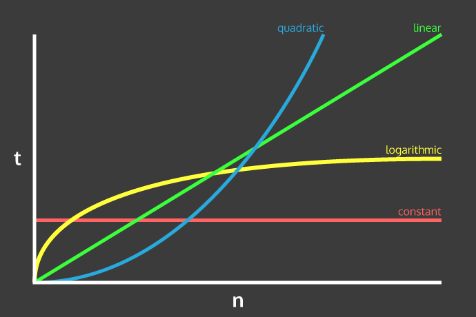
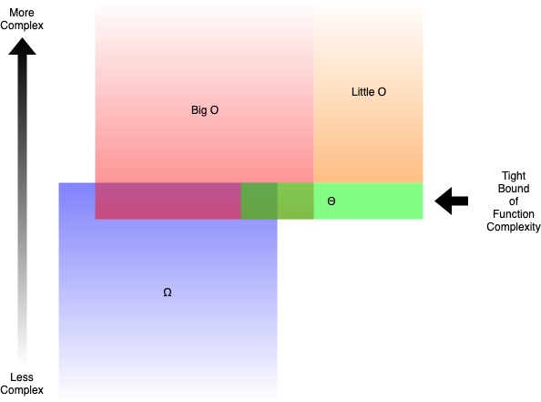

# Big-O Notation <!-- omit in toc -->



<p align="center">
    <small><i>Credit: <a href="http://callmenick.com/">http://callmenick.com/</a></i></small>
</p>

## Table of Contents <!-- omit in toc -->

- [Time Complexity Examples](#time-complexity-examples)
  - [`O(1)` Constant](#o1-constant)
  - [`O(logn)` Logarithmic](#ologn-logarithmic)
  - [`O(n)` Linear](#on-linear)
  - [`O(nlogn)` ---](#onlogn----)
  - [`O(n**2)` Quadratic](#on2-quadratic)
  - [`O(2**n)` ---](#o2n----)
  - [`O(n**n)` ---](#onn----)
  - [`O(n!)` Factorial](#on-factorial)
- [Space Complexity](#space-complexity)
- [Arrays](#arrays)
- [Related subjects](#related-subjects)

## Time Complexity Examples

### `O(1)` Constant

```ts
function add(a: number, b: number): number {
  return a + b;
}
```

### `O(logn)` Logarithmic

```ts
function guessNumber(num: number): number {
  const min = 1;
  const max = 10;

  if (num < min || num > max) {
    throw `Number must be in range ${min}-${max}.`;
  }

  const nums = [1, 2, 3, 4, 5, 6, 7, 8, 9, 10];

  const guess = (guesses = 1, i = Math.floor(nums.length / 2)): number => {
    if (nums[i] === num) return guesses;
    if (nums[i] > num) {
      return guess(++guesses, i - Math.floor(nums.length / (2 * guesses)));
    } else {
      return guess(++guesses, i + Math.floor(nums.length / (2 * guesses)));
    }
  };

  return guess();
}
```

### `O(n)` Linear

```ts
function max(nums: number[]): number {
  return nums.reduce((max, num) => (num > max ? num : max));
}
```

### `O(nlogn)` ---

```ts
function guessNumbers(nums: number[]): number[] {
  return nums.map((num) => guessNumber(num));
}
```

### `O(n**2)` Quadratic

```ts
function maxes(numArrs: number[][]): number[] {
  return numArrs.map((nums) => max(nums));
}
```

### `O(2**n)` ---

_No example_

### `O(n**n)` ---

_No example_

### `O(n!)` Factorial

_No example_

## Space Complexity

TODO

## Arrays

> - Access - **O(1)**
> - Appending - Amortized **O(1)** (sometimes resizing the hashtable > is required; usually only insertion is required)
> - Prepending - **O(n)** via unshift, since it requires reassigning > all the indexes
> - Insertion - Amortized **O(1)** if the value does not exist. **O(n)> ** if you want to shift existing values (Eg, using splice).
> - Deletion - Amortized **O(1)** to remove a value, **O(n)** if you > want to reassign indices via splice.
> - Swapping - **O(1)**
>
> https://stackoverflow.com/a/11535121

## Related subjects



- Little O
- Theta `Θ`
- Omega `Ω`
